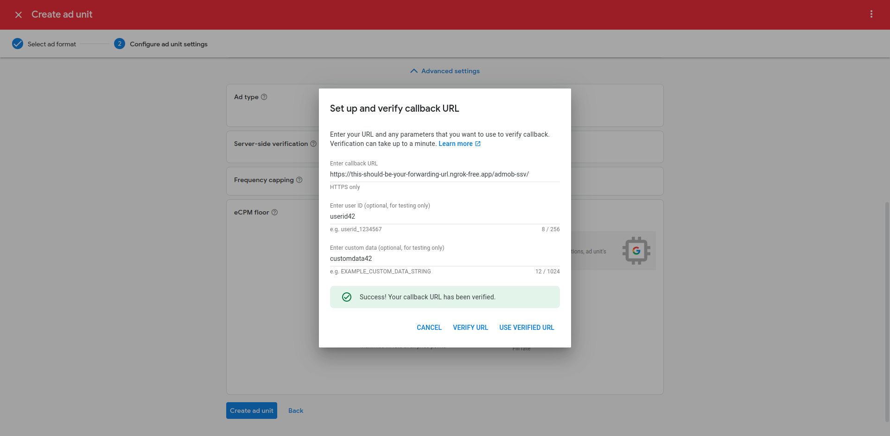

# Django Admob server-side verification (SSV)

[![PyPI][pypi-image]][pypi-url]
![PyPI - Python Version][python-image]
![PyPI - Django Version][django-image]
[![Codecov][codecov-image]][codecov-url]
[![License][license-image]][license-url]

[pypi-image]: https://img.shields.io/pypi/v/django-admob-ssv
[pypi-url]: https://pypi.org/project/django-admob-ssv/
[python-image]: https://img.shields.io/pypi/pyversions/django-admob-ssv
[django-image]: https://img.shields.io/pypi/djversions/django-admob-ssv
[codecov-image]: https://codecov.io/gh/DoctorJohn/django-admob-ssv/branch/main/graph/badge.svg
[codecov-url]: https://codecov.io/gh/DoctorJohn/django-admob-ssv
[license-image]: https://img.shields.io/pypi/l/django-admob-ssv
[license-url]: https://github.com/DoctorJohn/django-admob-ssv/blob/master/LICENSE

A Django app providing a view for handling Admob server-side verification callbacks.
Successfully verified callbacks trigger a custom Django signal.
Apps in your project may listen to that signal and reward the user
based on the information received via the callback.

Taken from the [Admob SSV documentation](https://developers.google.com/admob/android/rewarded-video-ssv):

> Server-side verification callbacks are URL requests, with query parameters expanded by Google, that are sent by Google to an external system to notify it that a user should be rewarded for interacting with a rewarded video ad. Rewarded video SSV (server-side verification) callbacks provide an extra layer of protection against spoofing of client-side callbacks to reward users.

## Installation

```sh
pip install django-admob-ssv
```

Add a `path` for the `admob_ssv.views.AdmobSSVView` view to your `urlpatterns`.

```python
from django.urls import path
from admob_ssv.views import AdmobSSVView


urlpatterns = [
    path('admob-ssv/', AdmobSSVView.as_view()),
]
```

Listen to the `admob_ssv.signals.valid_admob_ssv` signal and make sure
you [connect your receiver properly][receiver-docs], otherwise it won't
get called. Take a look at the "Where should this code live?" box.

[receiver-docs]: https://docs.djangoproject.com/en/4.2/topics/signals/#connecting-receiver-functions

```python
from django.dispatch import receiver
from admob_ssv.signals import valid_admob_ssv


@receiver(valid_admob_ssv)
def reward_user(sender, query, **kwargs):
    ad_network = query.get('ad_network')
    ad_unit = query.get('ad_unit')
    custom_data = query.get('custom_data')
    # ...
```

Reference the official Admob SSV documentation for a
[list of all SSV callback parameters][callback-docs].

[callback-docs]: https://developers.google.com/admob/android/rewarded-video-ssv

## Settings

You may optionally set the following options in your Django `settings.py` file.
The code snippet below shows the default values used.

```python
from datetime import timedelta


ADMOB_SSV_KEY_SERVER_URL = "https://www.gstatic.com/admob/reward/verifier-keys.json",

ADMOB_SSV_KEYS_CACHE_TIMEOUT = timedelta(days=1)

ADMOB_SSV_KEYS_CACHE_KEY = "admob_ssv.public_keys"
```

## Usage without Django signals

If you don't want to use Django signals, you may subclass the
`admob_ssv.views.AdmobSSVView` view and override the `handle_valid_ssv`
method.

Note that unless you call `super().handle_valid_ssv(request)`,
the `admob_ssv.signals.valid_admob_ssv` signal won't be sent.

```python
from admob_ssv.views import AdmobSSVView


class MyAdmobSSVView(AdmobSSVView):
    def handle_valid_ssv(self, request) -> None:
        query = request.GET.dict()
        ad_network = query.get('ad_network')
        ad_unit = query.get('ad_unit')
        custom_data = query.get('custom_data')
        # ...
```

Finally add a `path` for your custom view to your `urlpatterns`.

```python
from django.urls import path
from my_app.views import MyAdmobSSVView


urlpatterns = [
    path('admob-ssv/', MyAdmobSSVView.as_view()),
]
```

## Using a custom ECDSA library

This project uses the [ecdsa](https://pypi.org/project/ecdsa/) Python
package to verify the signature of incoming Admob SSV callbacks.

If you want to use a different ECDSA library, you may subclass the
`admob_ssv.views.AdmobSSVView` view and override the `verify_signature`
method.

```python
from admob_ssv.views import AdmobSSVView


class MyAdmobSSVView(AdmobSSVView):
    def verify_signature(
        self, public_key: str, signature: bytes, content: bytes
    ) -> bool:
        # Verify the signature using your custom ECDSA library.
        # Return True if the signature is valid, False otherwise.
        pass
```

Finally add a `path` for your custom view to your `urlpatterns`.

```python
from django.urls import path
from my_app.views import MyAdmobSSVView


urlpatterns = [
    path('admob-ssv/', MyAdmobSSVView.as_view()),
]
```

## Verify that callbacks are coming from Google

According to the [AdMob SSV FAQ section](https://developers.google.com/admob/android/ssv#faq) one could do the following:

> Use reverse DNS lookup to verify that SSV callbacks originate from Google.

Depending on your setup, possibly behind a reverse proxy, it's not
trivial to determine the origin IP address of a callback.

Checking the wrong IP address could lead to callbacks being ignored.
That's why we decided to leave callback origin verification up to you.

**Tip**: It appears to be sufficient to check whether the callback
contains one of your ad unit ids, which is covered by the signature.

## Example project

Take a look at our Django example project under `tests/project`.
You can run it by executing these commands:

1. `poetry install`
2. `poetry run python tests/project/manage.py migrate`
3. `poetry run python tests/project/manage.py createsuperuser`
4. `poetry run python tests/project/manage.py runserver`

### Live testing

The example project can be used to test Admob server-side verification
live from your local machine. You may use a service like
[ngrok](https://ngrok.com/) to forward requests from the internet to
your local machine and the Django webserver running at port `8000`.

```sh
ngrok http 127.0.0.1:8000
```

You are now ready to send test Admob server-side verification callbacks
from the Admob console.


